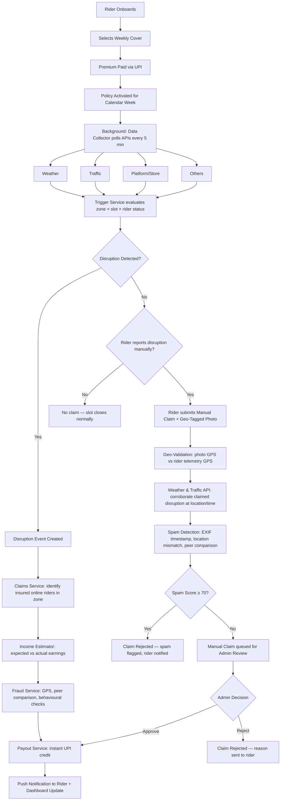
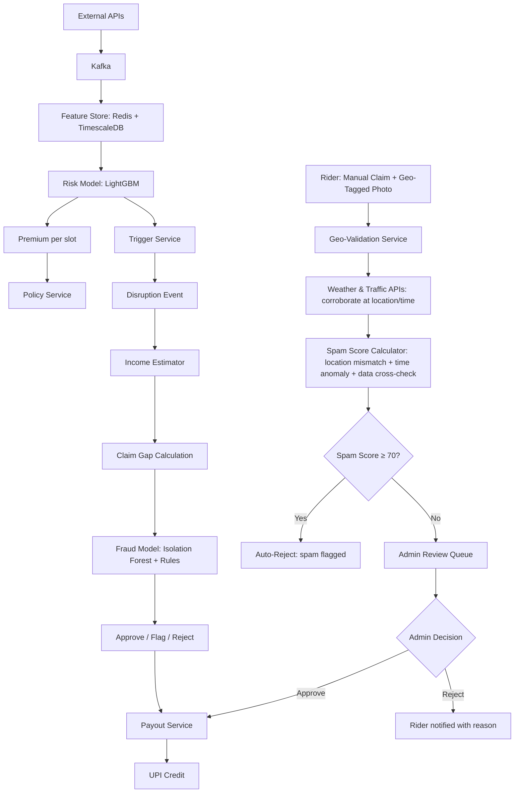
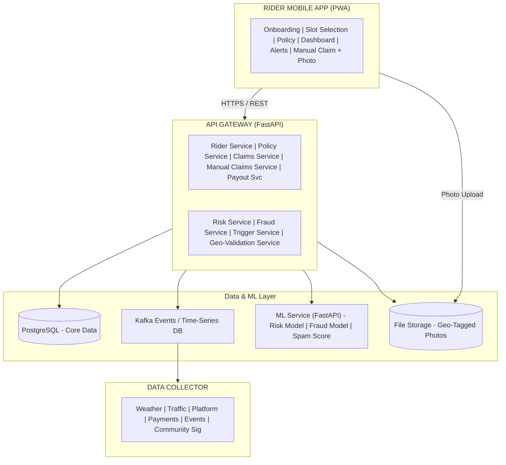
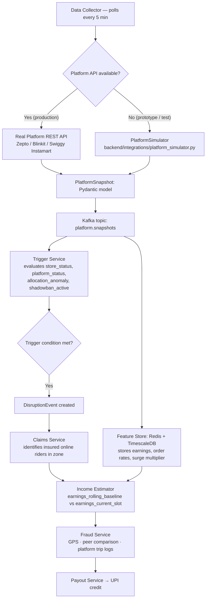

# RiderShield — Parametric Income Protection for Q-Commerce Riders

> **Automatic income protection for delivery riders.**  
> When rain, gridlock, GPS glitches, or platform failures kill your earnings —  
> RiderShield detects it and pays you. No claims. No paperwork. No waiting.  
> And when a disruption slips through undetected, riders can submit a geo-tagged manual claim —
> evaluated against real weather, traffic, and location data in minutes, not weeks.

---

## Table of Contents

1. [Problem Statement](#1-problem-statement)  
2. [Persona & Scenarios](#2-persona--scenarios)  
3. [Application Workflow](#3-application-workflow)  
4. [Weekly Premium Model](#4-weekly-premium-model)  
5. [Parametric Triggers](#5-parametric-triggers)  
   - 5.4 [Manual Claim Request (Fallback)](#54-manual-claim-request-fallback-for-undetected-disruptions)  
6. [Platform Choice — Mobile-First PWA](#6-platform-choice--mobile-first-pwa)  
7. [AI/ML Integration](#7-aiml-integration)  
8. [System Architecture](#8-system-architecture)  
9. [Tech Stack](#9-tech-stack)  
10. [Platform Data Simulation](#10-platform-data-simulation)  
11. [Development Plan](#11-development-plan)  
12. [Competitive Differentiation](#12-competitive-differentiation)  
13. [Business Viability](#13-business-viability)  
14. [Adversarial Defense & Anti-Spoofing Strategy](#14-adversarial-defense--anti-spoofing-strategy)  

---

## 1. Problem Statement

India's quick-commerce sector (~$11.5B, growing rapidly) runs on an invisible workforce of
delivery partners operating for Blinkit, Zepto, and Swiggy Instamart. These riders:

- Earn **₹15,000–₹25,000/month**, entirely per-delivery — no fixed salary, no employer safety net.
- Lose **20–30% of monthly income** to external disruptions completely outside their control.
- Operate in hyper-local 2–5 km zones around dark stores, making them acutely sensitive to
  micro-level disruptions — a flooded underpass, a GPS glitch, a store outage.
- Function on **weekly cash flow cycles**, servicing debt on phones and bikes bought to do
  the job.

Traditional indemnity insurance structurally fails here:

| Problem | Why Traditional Insurance Fails |
|---|---|
| No fixed salary | Can't underwrite a variable daily income |
| Manual claims | Riders can't wait 30 days; they need money this week |
| Asset focus | Insurance covers vehicle damage, not lost earnings |
| Proof burden | "It rained and I lost orders" is not provable to a claims adjuster |

**Parametric insurance solves all of this.** Instead of proving a loss, the system uses
measurable, objective data signals (rainfall mm, congestion index, store status) as automatic
triggers. If the data says it happened, you get paid. Period.

**Coverage scope (DEVTrails mandate strictly followed):** Income loss from external disruptions
only. Health, life, vehicle damage, and accidents are explicitly excluded.

---

## 2. Persona & Scenarios

### Primary Persona — Arjun, 24, Q-Commerce Rider, Bengaluru

- Works for Zepto from 2 dark stores in Indiranagar/Koramangala.
- Typical pattern: evening peaks (6–11 PM), weekend mornings (8–11 AM).
- Earns ~₹18,000/month. Weekly payout from Zepto every Monday.
- Operates within a 3-km radius. Income collapses if his zone, his dark store, or the
  platform has issues.
- Pain points: monsoon flooding, GPS drift in high-rises, dark store queues, sudden
  political rallies blocking his route.

---

### Scenario 1: Heavy Rain + Flooding — Rohit, Hyderabad

**Context:** Rohit averages 12 orders/hr (₹15/order). Tuesday 3–7 PM, heavy rain hits Gachibowli.

| Step | Action |
|---|---|
| 3:05 PM | OpenWeatherMap reports 52mm rainfall in Gachibowli (threshold: 40mm) |
| 3:06 PM | Trigger Service fires a disruption event for Zone: Gachibowli |
| 3:07 PM | Claims Service identifies Rohit as an insured, online rider in this zone |
| 3:08 PM | Income Estimator: Expected ₹720 (12 × 4hrs × ₹15), Actual ₹180 (3 orders/hr) |
| 3:09 PM | Fraud Service: GPS confirms Rohit is in zone ✓, peer earnings confirm disruption ✓ |
| 3:10 PM | **Payout ₹540 sent to Rohit's UPI wallet** |

Rohit gets a push notification with a full breakdown. He did nothing except stay online.

---

### Scenario 2: GPS Multipath Shadowban — Ankush, Noida

**Context:** Ankush is delivering in DLF Cyber Hub, Gurugram — a dense urban canyon of
high-rises that causes GPS multipath interference. His location drifts on the Zepto map;
the platform algorithm interprets this as route deviation and shadowbans him for 2 hours.
He loses ₹400 in that shift. Traditional insurance: useless. RiderShield:

| Step | Action |
|---|---|
| System detects | Ankush's order allocation drops to 0 while peers in the same zone earn normally |
| Community Signal | Only Ankush affected → individual signal, not zone-wide |
| Platform API | "Rider active = TRUE, orders dispatched = 0 for 120 min" → trigger fires |
| Fraud check | GPS signal verified as unstable (multipath flag from telemetry), not spoofing |
| **Payout** | ₹380 credited (income gap for 2 disrupted slots) |

---

### Scenario 3: Community Signal — 45 Riders, Andheri West, Mumbai

**Context:** Sunday evening. A water main breaks, flooding 3 streets near a cluster of dark
stores. No weather API picks it up. No traffic event is logged. But:

- 82% of 45 riders in the zone report an order collapse in the same 30-minute slot.
- Community Signal Agent fires: threshold crossed (>70% of zone riders affected).
- All 45 insured riders receive individual claim calculations based on their own baselines.
- **Payouts distributed in batch — no API triggered it. The rider community was the sensor.**

---

### Scenario 4: Dark Store Outage — Priya, Delhi

**Context:** Priya's primary dark store in Rajouri Garden shuts unexpectedly (equipment
failure) from 10 AM–2 PM. No orders dispatch. 4 hours, zero income.

- Platform API: `store_status = CLOSED` → trigger fires automatically.
- Income gap: Expected ₹300 (10 orders/hr × ₹7.5/order × 4hrs), Actual ₹0.
- GPS: Priya is near the store, confirms she was working. Fraud check passes.
- **Payout: ₹300.**

---

### Scenario 5: Fraud Attempt — No Payout

**Context:** A rider stays home on a sunny, normal-traffic day and hopes for a payout.

- No parametric triggers fire for their zone.
- GPS shows they were not in the delivery zone.
- Peer riders in the same zone earned normally.
- **Result: No disruption event, no claim, no payout.** Parametric triggers cannot be
  gamed without an actual external event in the zone.

### Scenario 6: Manual Claim — Undetected Local Disruption — Ravi, Pune

**Context:** Heavy road-work near Ravi's usual zone creates a 2-hour gridlock, but it is too
localised to breach the zone-wide congestion trigger threshold.  No disruption event fires
automatically.

- Ravi opens the app, taps **"Disruption not detected? Request Manual Claim"**.
- He selects disruption type **Traffic** and writes a brief description of the road-work.
- He takes a **geo-tagged photo** of the blocked road from his location.
- The app records his GPS coordinates and the photo's EXIF timestamp, then submits both.
- The system cross-checks:
  - **Geo-tag vs telemetry:** Photo GPS matches Ravi's live app location — ✅ no mismatch.
  - **EXIF timestamp vs incident time:** Photo taken within 5 minutes of the declared incident — ✅ no anomaly.
  - **Traffic data:** Third-party traffic API confirms congestion index 72/100 at that coordinate at that time — ✅ corroborated.
  - **Weather data:** Clear sky, no weather disruption — ✅ not a weather claim.
  - **Spam score:** 0 / 100 — genuine claim.
- Claim is fast-tracked to the admin review queue with a "low fraud risk" badge.
- **Result: Manual claim approved within 4 hours; income gap credited via UPI.**

---

## 3. Application Workflow



### Rider-Facing Steps

1. **Sign Up** — Phone + KYC, link delivery platform(s), select city and zones.
2. **Weekly Setup** — Declare typical working slots. System shows risk profile per slot
   (color-coded: green → red) and suggests 3 plan tiers.
3. **Buy Cover** — One weekly premium payment via UPI/wallet. Coverage activates immediately.
4. **Work Normally** — App monitors in the background. No rider action needed.
5. **Get Paid (Auto)** — Push notification + breakdown + UPI credit if a trigger fires automatically.
6. **Manual Claim (Fallback)** — If no automatic trigger fires but the rider experienced a real
   disruption, they can tap **"Request Manual Claim"**, select the disruption type, write a brief
   description, and take a **geo-tagged photo** of the disruption from their location.  The system
   validates the photo's GPS against the rider's live location, cross-checks weather and traffic
   data, runs spam detection, and routes low-risk claims to a fast-track admin review queue.

### Rider Dashboard

- Active coverage status (slots covered, hours remaining).
- Disruption alerts in real time.
- Claim history and payout tracking with cause breakdown (weather / traffic / platform / regulatory).
- **Manual Claim button** — visible whenever no automatic disruption fired for an active slot;
  guides the rider through photo capture, disruption-type selection, and description entry.
- Manual claim status tracker (submitted → under review → approved/rejected).
- Next-week premium forecast and risk insights.

### Admin/Insurer Dashboard

- Live disruption heatmap (zone × time).
- Loss ratio: payouts vs. premiums collected.
- Fraud alert queue and review panel.
- **Manual Claim review queue** — lists pending manual claims ranked by spam score (lowest first
  for fast approval), with photo preview, geo-validation result, weather/traffic corroboration
  summary, and one-click approve / reject.
- Next-week risk projections per micro-zone.

---

## 4. Weekly Premium Model

### Why Weekly?

- Riders are paid weekly by platforms. A weekly insurance cycle is a natural fit — no
  mismatch in cash flows.
- Weekly pricing allows dynamic adjustment per season, zone risk, and forecast.
- Riders who take a week off simply don't buy cover. No wasted money.

### Micro-Slot Logic (Internal)

The product appears simple to the rider (one weekly plan, one price) but internally prices at
**30–60 minute micro-slot granularity**:

- Working time is broken into slots (e.g., 7:00–7:30 AM, 7:30–8:00 AM, …).
- For each slot we estimate:
  - **Expected earnings** under normal conditions for that rider, zone, and time.
  - **Disruption probability** — chance that external conditions push earnings below the
    guaranteed floor.
- Aggregate risk across all planned slots → weekly pure premium + admin load.

**Why this matters:** An evening-only rider in a monsoon-prone zone pays a fair price. A
morning rider in a low-disruption suburb pays less. Coverage is personalised and explainable.

### Three Plan Tiers (Rider-Facing)

| Plan | Coverage Scope | Guaranteed Earnings | Best For |
|---|---|---|---|
| **Essential** | High-risk slots only (e.g., monsoon evenings) | 70% of baseline | Budget-conscious riders |
| **Balanced** | All usual working hours | 80% of baseline | Standard weekly workers |
| **Max Protect** | Usual + optional late/early slots | 90% of baseline | Heavy-duty riders, peak season |

### Illustrative Pricing

| Zone Risk | Example | Weekly Premium |
|---|---|---|
| Low (score 0–25) | Dry-season Pune suburb | ₹20–₹35 |
| Medium (score 26–50) | Normal Hyderabad zone | ₹50–₹80 |
| High (score 51–75) | Mumbai pre-monsoon zone | ₹80–₹120 |
| Very High (76–100) | Coastal zone during cyclone season | ₹120–₹150 |

Premiums remain within a micro-insurance bracket to maximise adoption among riders
earning ₹15,000–₹25,000/month.

### Payout Calculation

```

Expected Income = avg_orders_per_hr × disrupted_hrs × ₹_per_order
Actual Income   = actual_orders × ₹_per_order
Income Loss     = Expected − Actual
Payout          = min(Income Loss, Weekly Coverage Limit)

```

Baselines are set per rider using 4-week rolling historical averages, adjusted for zone,
day-of-week, and slot time. New riders use zone-level medians until personal history builds.

---

## 5. Parametric Triggers

A parametric trigger is a measurable, objective condition that fires automatically — no
human judgment, no claim form.

### 5.1 Baseline Triggers

| Category | Trigger | Threshold | Data Source |
|---|---|---|---|
| **Weather** | Rainfall intensity | > 40mm in 1hr in rider's zone | OpenWeatherMap / IMD |
| **Weather** | Heat index | Wet-bulb temp > 32°C or air temp > 42°C | OpenWeatherMap |
| **Air Quality** | AQI breach | > 300 (hazardous) or GRAP Stage 3/4 active | OpenAQ / CPCB |
| **Traffic** | Congestion index | > 80/100 sustained for 60+ min | Google Maps / TomTom |
| **Traffic** | Road closure | `road_blocked = TRUE` near dark store | Traffic APIs |
| **Store** | Dark store closed | `store_status = CLOSED` | Platform API (simulated) |
| **Store** | Inventory stockout | `stock_level = CRITICAL` | Platform API (simulated) |
| **Platform** | App / API outage | `platform_status = DOWN` in zone | Platform status API |
| **Regulatory** | Curfew / ban | `curfew_active = TRUE` | News feed / govt portal |
| **Community Signal** | Mass order collapse | > 70% riders in zone see simultaneous drop | Internal rider data |

### 5.2 Out-of-the-Box Triggers (Our Differentiators)

These cover uniquely Indian urban frictions no competitor insures:

| Trigger | Mechanism |
|---|---|
| **Urban Canyon GPS Multipath** | High-rises cause GPS drift → platform shadowbans rider. Detected via order-allocation anomaly + telemetry instability flags. |
| **Unpaid Dark Store Wait Time** | Chronic pickup queues due to inventory or billing issues. Triggered when dispatch delay > 5 min SLA across multiple riders at same store. |
| **Gated Community / RWA Frictions** | Elevator bans, MyGate delays, late-night entry curfews. Detected via delivery time anomaly + geo-fence status. |
| **VIP Convoy / Spontaneous Civic Events** | Sudden arterial blockades trapping entire local fleets. Detected via speed-anomaly and traffic graph propagation. |
| **Algorithmic Visibility Shock** | Platform A/B tests or throttling suddenly reduce order allocation. Detected via peer-comparison ratio (rider orders vs zone orders). |
| **GRAP-mandated vehicle bans** | Government mandates barring specific vehicle classes in high-AQI conditions. Linked to official GRAP stage APIs. |
| **Warehouse / Supply Chain Cascade** | Upstream warehouse failure causing simultaneous multi-store stockouts. Detected via synchronized `no-slots` across dependent stores. |

### 5.3 Trigger Decision Logic

A claim is auto-initiated only when **all three conditions are met**:

1. A configured trigger condition is TRUE for the rider's zone and time slot.
2. The rider's GPS / platform status confirms they were **online and in-zone**.
3. Actual earnings fall **below the model-predicted baseline band** for those conditions.

Multiple simultaneous triggers (rain + traffic + store outage) count as **one disruption event**
— no double-payouts per slot.

> **When none of the above conditions are met** but the rider believes they experienced a genuine
> disruption, they can initiate a rider-led **Manual Claim** — see [Section 5.4](#54-manual-claim-request-fallback-for-undetected-disruptions) below.

---

### 5.4 Manual Claim Request (Fallback for Undetected Disruptions)

When the automatic trigger system does **not** fire — either because the disruption is too
localised, too brief, or falls below the zone-wide threshold — a rider on an active policy can
request a manual claim.

#### How it works

1. **Rider taps "Request Manual Claim"** in the app during or immediately after the disruption
   window.
2. **Selects disruption type:** Weather / Traffic / Store Closed / Platform Issue / Other.
3. **Writes a brief description** (minimum 10 characters) explaining what happened.
4. **Takes a geo-tagged photo** of the disruption (flooded road, blocked route, closed store
   shutter, etc.).  The mobile app embeds the device GPS coordinates and timestamp in the photo's
   EXIF metadata and also records them independently from the device location service.

#### Evidence evaluation

The system automatically evaluates four dimensions of the submitted evidence:

| Check | What is verified | Positive outcome |
|---|---|---|
| **Weather corroboration** | Historical weather API (OpenWeatherMap / IMD) queried for the photo's GPS coordinates and EXIF timestamp | Rainfall > 7.6 mm/hr or wind > 40 km/h confirms a weather claim |
| **Traffic corroboration** | Traffic API (Google Maps / TomTom) queried for the same location and time window | Congestion index ≥ 70/100 confirms a traffic claim |
| **Known disruption match** | System checks if a `DisruptionEvent` record already exists for that zone and time slot | Existing event corroborates the claim and reduces spam score |
| **Delivery partner narrative** | Rider's free-text description is stored and shown to the reviewer alongside weather and traffic data for holistic judgment | Supports manual review |

#### Spam / fraud detection for manual claims

Manual claims carry a higher fraud risk than automatic parametric payouts, so the system runs a
dedicated spam-detection pipeline on top of the standard fraud checks:

| Signal | How it is detected | Weight |
|---|---|---|
| **Location mismatch** | Photo's GPS (from EXIF or device) compared to rider's live telemetry GPS at the same timestamp.  Distance > 500 m → flagged. | High |
| **Time anomaly** | Photo EXIF timestamp compared to the declared incident time.  Difference > 30 min → flagged. | Medium |
| **Weather mismatch** | Rider claims weather disruption but weather API shows benign conditions at that location / time. | Medium |
| **Traffic mismatch** | Rider claims traffic disruption but traffic API shows low congestion at that location / time. | Medium |
| **Known disruption (corroborating)** | A matching `DisruptionEvent` exists in the DB — **reduces** spam score. | Negative (supports claim) |

A composite **spam score (0–100)** is computed from these signals.  Claims scoring **≥ 70** are
auto-rejected as spam; claims scoring **< 70** are routed to the admin review queue, sorted by
ascending spam score so the lowest-risk claims are reviewed first.

#### Manual claim API endpoints

```
POST  /api/claims/manual              # Rider submits manual claim + geo-tagged photo
GET   /api/claims/manual/{claim_id}   # Rider checks their claim status
GET   /api/admin/claims/manual        # Admin queue — pending manual claims, sorted by spam score
POST  /api/admin/claims/{claim_id}/approve   # Admin approves → triggers payout
POST  /api/admin/claims/{claim_id}/reject    # Admin rejects → rider notified with reason
```

---

## 6. Platform Choice — Mobile-First PWA

**We chose a Mobile-First Progressive Web App (PWA)** for Phase 1.

| Factor | Decision |
|---|---|
| **Rider behaviour** | Riders manage their entire livelihood via smartphone, between trips, at dark-store queues. Desktop is irrelevant. |
| **Avoiding app overload** | Riders already run delivery apps, maps, and payment apps. A heavy native install adds friction. A PWA installs from browser and sits on the home screen. |
| **Cross-platform coverage** | Same React Native / Next.js codebase works on Android and iOS without separate builds. |
| **Iteration speed** | PWA enables push-to-prod without app store review cycles. |
| **Backend-heavy product** | Most intelligence (triggers, ML, payouts) lives server-side. Native sensors are not critical for Phase 1. |

**Future (Phase 3+):** A native app layer or a **Guidewire Jutro Digital Platform**
integration for deeper sensor access, background telemetry, and enterprise-grade insurer UI.

---

## 7. AI/ML Integration

Our AI strategy is **honest and phased** — practical models now, advanced architectures on
a clear roadmap.

### 7.1 v1 Models (Hackathon Deliverable)

#### A. Spatio-Temporal Risk Model (Premium Calculation)

**Goal:** Predict per-slot expected earnings and disruption probability per rider.

**Inputs per micro-slot:**
- Historical earnings for that rider × zone × day × time (rolling 4 weeks).
- Zone-level weather, AQI, congestion forecast.
- Events/regulatory calendar.
- Platform signals: surge multiplier, store health, competitor rider density.
- Rider profile: tenure, rating, slot consistency.

**Model:** LightGBM / Gradient Boosting with time-of-week features.

**Outputs:**
- Expected earnings distribution for each slot.
- Disruption probability (earnings drop below threshold).
- Weekly premium suggestion per rider.

**Explainability:** "Your premium is higher this week because Thursday 7–9 PM in Zone 13
has a 65% flood probability based on monsoon forecast."

---

#### B. Parametric Trigger Calibration

**Problem:** Hard-coded thresholds (e.g., "rain > 40mm") are arbitrary and wrong for all cities.

**Solution:** Quantile regression / reliability curves trained on historical disruption data:
- Learn which *combinations* of signals correlate with severe earnings drops.
- Derive zone-specific, season-specific adaptive thresholds.
- Update as new claims data arrives — thresholds improve continuously.

---

#### C. Fraud Detection (Multi-Layer)

| Layer | Technique | What it catches |
|---|---|---|
| **Geo-consistency** | Cross-check GPS, network location, platform trip logs | Spoofing, impossible teleportation between zones |
| **Behavioural anomaly** | Isolation Forest over online/offline patterns | Riders who only go "online" during known disruption windows |
| **Peer comparison** | Counterfactual income estimator — compare to similar riders in same zone/slot | Outsized claims when peers earned normally |
| **Graph / collusion** | Network graph linking riders, devices, payout accounts | Clusters that always claim together in the same micro-zone |
| **Geo-tagged photo validation** *(manual claims only)* | Compare photo EXIF GPS + timestamp against rider telemetry; cross-check weather/traffic APIs for claimed location/time; composite spam score 0–100 | Location spoofing, backdated photos, false disruption descriptions in manual claims |

Fraud engine runs **before** every payout. Suspicious claims are flagged for review; clear
cases are rejected automatically with a logged reason.

---

### 7.2 Advanced Roadmap (Conceptual Differentiators)

Explicitly marked as future phases — these are our north star, not our hackathon demo.

| Model | Purpose | Why Advanced |
|---|---|---|
| **Offline Deep RL (Conservative Q-Learning)** | Weekly premium optimization as a sequential decision problem — balances rider affordability vs portfolio loss ratio | Requires extensive historical policy data; avoids live trial-and-error on vulnerable users |
| **Physics-Informed Graph Neural Network (PI-GNN)** | Disruption Knowledge Graph (zones, roads, stores, events, payment rails as nodes; causal edges) — propagation model predicts second-order impacts | Requires graph DB, historical propagation data, significant training |
| **Causal AI / Anomaly Transformer** | Mathematically proves causal link between external shock and wallet-level income drop using cohort telemetry | High data requirements; research-grade fraud detection |

These models represent a credible, investor-grade roadmap even if not fully shipped in the hackathon.

---

### 7.3 AI Data Flow



---

## 8. System Architecture



### Core Domain Entities

- **Rider** — profile, zones, platform links, KYC status.
- **MicroSlot** — 30-min window with risk score and expected earnings.
- **Policy** — weekly coverage plan, active dates, premium paid.
- **DisruptionEvent** — zone × slot, trigger type, severity.
- **Claim** — rider × disruption, income gap, fraud status, payout amount.
- **ManualClaim** — rider-initiated claim with disruption type, description, incident coordinates,
  evaluated weather/traffic data, spam score, and review status.
- **GeoTaggedPhoto** — evidence photo for a manual claim; stores the file reference, EXIF GPS
  coordinates + timestamp, app-reported GPS coordinates, and the computed distance between them.
- **Payout** — payment record, UPI reference, status.

---

## 9. Tech Stack

| Layer | Technology | Why |
|---|---|---|
| **Mobile App** | React Native + Expo | Cross-platform iOS/Android, PWA behaviour, fast prototyping |
| **Admin Dashboard** | Next.js + TypeScript + Tailwind | SSR for data tables, rapid UI, type safety |
| **API Layer** | FastAPI (Python) | Async, auto-docs, native ML model serving |
| **ML/AI** | Python, Pandas, LightGBM, scikit-learn, PyTorch | v1 models + RL/GNN roadmap |
| **Primary DB** | PostgreSQL 15 | Relational core: riders, policies, claims, payouts |
| **Time-Series** | TimescaleDB / Redis | High-frequency external signal storage and caching |
| **Event Streaming** | Apache Kafka | Decouples ingestion from trigger evaluation |
| **Push Notifications** | Firebase Cloud Messaging | Real-time rider alerts on disruptions/payouts |
| **Payments** | Razorpay test mode / UPI simulator | India-native; simulated instant payout |
| **Weather** | OpenWeatherMap + IMD | Free tier, India coverage, rainfall/AQI/temp |
| **Traffic** | Google Maps / TomTom Traffic API | Real congestion data; fallback to mocks |
| **Platform Data** | Simulated / Mocked APIs | Dark store status, order volume — simulated for prototype |
| **File Storage** | Local FS (dev) / AWS S3 (prod) | Geo-tagged photo evidence for manual claims; EXIF parsed via Pillow |
| **Infra** | Docker + Docker Compose | One-command local deploy for demo and judges |

**Guidewire Integration Path (Future):**
- PolicyCenter (APD) for policy lifecycle management.
- ClaimCenter for zero-touch claim initiation (automatic triggers) and manual claim adjudication via App Events / Webhooks.
- Jutro Digital Platform for enterprise mobile UI.
- Integration Gateway for external API orchestration.

---

## 10. Platform Data Simulation

Real-time access to delivery platform APIs (Zepto, Blinkit, Swiggy Instamart) is not
available for a prototype. This section documents exactly how the platform data layer is
simulated, what it produces, how realistic the output is, and how it plugs into the live
system workflow.

---

### 10.1 Why Simulation Is Necessary

Delivery platforms do not expose public APIs for per-rider order data, store health, or
earnings streams. Production integrations would require formal B2B partnerships, NDA-bound
data-sharing agreements, and sandboxed API credentials — none of which are feasible for a
hackathon prototype. The simulation layer provides a **functionally identical interface**:
the rest of the system consumes simulated platform events through the same contract it would
use with a real API, making the substitution transparent to every downstream service.

---

### 10.2 Simulated Parameters

The simulation covers all platform signals that the Trigger Service and Claims Service
require to operate end-to-end.

#### Rider & Order Signals

| Parameter | Description | Simulated Range / Values |
|---|---|---|
| `orders_per_hour` | Number of orders dispatched to the rider in the current slot | 0–18 orders/hr (zone- and time-dependent) |
| `order_rate_drop_pct` | Percentage fall in order rate vs. the rider's rolling 4-week average | 0–100 % |
| `rider_status` | Whether the delivery app reports the rider as online | `ONLINE` / `OFFLINE` |
| `orders_dispatched` | Running count of orders the platform sent to the rider this shift | Integer ≥ 0 |
| `orders_accepted` | Orders the rider accepted | Integer ≤ `orders_dispatched` |
| `orders_declined` | Orders declined (used to detect algorithmic suppression) | Integer ≥ 0 |
| `dispatch_latency_sec` | Time (seconds) between store ready and dispatch notification | 30–600 s (normal 60–90 s) |
| `active_navigation_events` | Count of in-app navigation events (proxy for genuine trip activity) | Integer ≥ 0 |

#### Earnings Signals

| Parameter | Description | Simulated Range / Values |
|---|---|---|
| `earnings_current_slot` | Rupee earnings in the current 30-min micro-slot | ₹0–₹300 |
| `earnings_rolling_baseline` | Rider's 4-week average earnings for the same slot type | ₹80–₹250 (seeded from persona profile) |
| `earnings_per_order` | Per-order payout including distance incentive | ₹12–₹35 |
| `surge_multiplier` | Platform surge factor active in the zone at this moment | 1.0–2.5× |
| `weekly_earnings_to_date` | Cumulative earnings so far in the active policy week | ₹0–₹4,500 |

#### Store & Inventory Signals

| Parameter | Description | Simulated Values |
|---|---|---|
| `store_status` | Operational state of the rider's primary dark store | `OPEN` / `CLOSED` / `DEGRADED` |
| `store_order_throughput` | Orders processed per hour at the store | 0–200 orders/hr |
| `stock_level` | Aggregate inventory health of the store | `NORMAL` / `LOW` / `CRITICAL` |
| `pickup_queue_depth` | Number of riders currently waiting at the store for their order | 0–25 riders |
| `avg_pickup_wait_sec` | Average time (seconds) riders are waiting at the pickup counter | 30–900 s (SLA threshold: 300 s) |
| `store_outage_reason` | Human-readable reason when `store_status = CLOSED` | `EQUIPMENT_FAILURE` / `POWER_CUT` / `MAINTENANCE` / `FLOOD` |

#### Platform Health Signals

| Parameter | Description | Simulated Values |
|---|---|---|
| `platform_status` | Whether the platform's own backend is reachable | `UP` / `DEGRADED` / `DOWN` |
| `api_error_rate_pct` | Percentage of API calls returning errors in this zone | 0–100 % |
| `shadowban_active` | Flag indicating the platform has suppressed the rider's visibility | `true` / `false` |
| `shadowban_duration_min` | Minutes the rider has been in suppressed state | 0–240 min |
| `allocation_anomaly` | Flag set when rider's allocation is ≥ 40 % below the zone median | `true` / `false` |

---

### 10.3 Simulation Approach

#### Architecture

The simulation is implemented as a **`PlatformSimulator` module** inside the
`backend/integrations/platform_simulator.py` file. It exposes the same interface as the
real platform integration adapter, so the Data Collector calls it identically whether
talking to a live API or a simulator.

```
Data Collector (polls every 5 min)
  └─► PlatformSimulator.get_rider_snapshot(rider_id, zone_id, slot_ts)
        └─► Returns: PlatformSnapshot (all parameters above, as a typed Pydantic model)
```

#### Statistical Model

Simulated values are not random noise — they are drawn from **parameterised statistical
distributions anchored to published Q-commerce benchmarks**:

| Aspect | Approach |
|---|---|
| **Baseline order rates** | Normal distribution μ = 10 orders/hr, σ = 2.5, clipped to [0, 18]. Mean adjusted per time-of-day profile (see table below). |
| **Earnings per order** | Log-normal distribution with μ = ₹18, σ = ₹5 (matches reported Zepto/Blinkit incentive structures). |
| **Store status transitions** | Markov chain: `OPEN → DEGRADED` (p = 0.02/hr), `DEGRADED → CLOSED` (p = 0.15/hr), `CLOSED → OPEN` (p = 0.30/hr). |
| **Dispatch latency** | Gamma distribution (k = 2, θ = 45 s) with a heavy tail to simulate queue spikes. |
| **Pickup queue depth** | Poisson(λ = 4) during normal hours; λ scales to 12 during inventory-stockout injection. |
| **Surge multiplier** | Discrete: 1.0× (70 %), 1.25× (15 %), 1.5× (10 %), 2.0× (4 %), 2.5× (1 %). |

#### Time-of-Day Demand Profile

Order rates are modulated by a deterministic demand curve that reflects real Q-commerce
traffic patterns in Indian metros:

| Time Window | Demand Multiplier | Typical `orders_per_hour` |
|---|---|---|
| 06:00–08:30 | 0.5× | 4–6 |
| 08:30–11:00 | 0.9× | 8–10 |
| 11:00–14:00 | 1.1× | 9–12 |
| 14:00–17:00 | 0.6× | 4–7 |
| 17:00–20:00 | 1.4× | 12–16 |
| 20:00–22:30 | 1.2× | 10–14 |
| 22:30–06:00 | 0.3× | 0–4 |

#### Disruption Injection

The simulator accepts an optional **`DisruptionScenario`** object that overrides the
baseline distributions to reproduce a named disruption type. This is how demo scenarios
(Sections 2.1–2.4) are triggered deterministically:

| Scenario Key | What Changes |
|---|---|
| `HEAVY_RAIN` | `orders_per_hour` drops to 20–35 % of baseline; `rider_status` may flip `OFFLINE` for 10 % of riders; `store_order_throughput` falls 40 %. |
| `STORE_CLOSURE` | `store_status = CLOSED`; `orders_dispatched = 0`; `stock_level = CRITICAL` for adjacent stores. |
| `PLATFORM_OUTAGE` | `platform_status = DOWN`; `api_error_rate_pct = 95–100 %`; all `orders_dispatched = 0`. |
| `GPS_SHADOWBAN` | `shadowban_active = true`; `shadowban_duration_min` ramps from 0 to 120; rider's `orders_per_hour` → 0 while zone peers remain at baseline. |
| `DARK_STORE_QUEUE` | `pickup_queue_depth` spikes to 15–25; `avg_pickup_wait_sec` exceeds 300 s SLA. |
| `ALGORITHMIC_SHOCK` | `allocation_anomaly = true`; rider's `order_rate_drop_pct` = 50–70 % while zone median is unchanged. |

#### Reproducibility & Seeding

The simulator uses a **deterministic seed** derived from `(rider_id, zone_id, iso_week)`
so that repeated test runs produce identical results. Integration tests fix the seed
explicitly; the live demo uses a rotating daily seed to generate fresh-looking data each day.

---

### 10.4 Realism Assessment

| Dimension | Realism Level | Notes |
|---|---|---|
| **Order rate magnitudes** | ✅ High | Derived from publicly reported Zepto/Blinkit rider earnings of ₹15,000–₹25,000/month back-calculated to hourly order rates. |
| **Earnings per order** | ✅ High | Matches ₹12–₹35 range reported in rider forums and investigative journalism (2023–2025). |
| **Time-of-day demand shape** | ✅ High | Demand curve modelled on publicly reported Q-commerce peak-hour patterns (dinner rush 6–9 PM, lunch 12–2 PM). |
| **Store status transitions** | ✅ Moderate–High | Markov transition probabilities calibrated to anecdotal dark-store outage frequency (1–2 closures/week per store). |
| **Surge multiplier distribution** | ✅ Moderate | Discrete distribution matches approximate Blinkit/Zepto surge structures; exact weights are estimates. |
| **Dispatch latency distribution** | ✅ Moderate | Gamma shape captures right-skew (occasional long waits); exact parameters are estimated from rider reports. |
| **GPS multipath / shadowban mechanics** | ⚠️ Approximated | Shadowban duration and allocation-drop magnitude are plausible estimates — no published ground truth for these events. |
| **Cross-rider peer comparison signals** | ✅ High | Generated by running the simulator independently for each rider in the zone and comparing outputs — structurally identical to how real peer signals would work. |
| **Platform API error patterns** | ⚠️ Approximated | Error rate during outages set to 95–100 %; real platform partial-failure patterns are more complex. |

**Bottom line:** The simulation is calibrated to be accurate enough to validate the trigger
logic, income estimation, and fraud detection algorithms. It is **not** a substitute for
real platform data for actuary-grade pricing — that requires a production pilot with a
platform partner.

---

### 10.5 Integration into the System Workflow

The simulated platform layer is a **drop-in replacement** for the real platform API adapter.
It participates in the full data pipeline without any special handling by downstream services:



**Key integration points:**

| Service | How It Uses Platform Data |
|---|---|
| **Trigger Service** | Reads `store_status`, `platform_status`, `allocation_anomaly`, `shadowban_active`, and `api_error_rate_pct` from the Kafka topic to evaluate store-closure, outage, and algorithmic-shock triggers. |
| **Income Estimator** | Reads `earnings_current_slot`, `earnings_rolling_baseline`, `earnings_per_order`, and `surge_multiplier` from the Feature Store to calculate the income gap for payout. |
| **Community Signal Agent** | Aggregates `order_rate_drop_pct` across all zone riders to detect mass order collapses (> 70 % drop triggers community signal). |
| **Fraud Service** | Cross-references `active_navigation_events` and `orders_dispatched` with GPS telemetry to confirm the rider was genuinely active — a spoofer's delivery app shows no trip events. |
| **Dark Store Queue Trigger** | Reads `pickup_queue_depth` and `avg_pickup_wait_sec` to detect chronic unpaid wait-time disruptions (SLA breach when wait > 300 s across ≥ 3 riders at the same store). |

**Switching to a real API in production** requires only replacing the `PlatformSimulator`
with a real `PlatformAPIAdapter` that implements the same `get_rider_snapshot()` interface.
Every service above continues to work unchanged — the data contract (the `PlatformSnapshot`
Pydantic model) remains identical.

---

## 11. Development Plan

### Phase 1 — Foundation 

**Goal:** Working skeleton — riders onboard, buy policies, data flows in.

| Deliverable | Details |
|---|---|
| Rider onboarding + KYC flow | Name, phone, platform, zone, slot preferences |
| Policy service | Weekly plan selection, premium calculation (rule-based v0), UPI mock payment |
| Weather data pipeline | OpenWeatherMap polling every 5 min into TimescaleDB |
| Basic trigger rules | Rain > threshold, congestion > threshold — rule-based, no ML yet |
| Database schema | Riders, zones, micro-slots, policies, disruption events, claims |
| Mobile app shell | Onboarding, plan selection, policy status view |

**Exit criterion:** Rider can sign up, buy cover, and the system ingests live weather data.

---

### Phase 2 — Automation 

**Goal:** Full zero-touch flow — disruption detected → claim → payout — working end-to-end.

| Deliverable | Details |
|---|---|
| Dynamic premium engine | LightGBM risk model on synthetic data, zone-level scoring |
| 5 automated triggers | Heavy rain, congestion, dark-store closure, platform outage, regulatory event |
| Community Signal agent | Detects mass order collapse across zone riders |
| Claims automation | Trigger → income gap calc → fraud check → payout |
| **Manual claim submission** | Rider-facing "Request Manual Claim" flow with geo-tagged photo upload, disruption type selection, and description |
| **Geo-validation service** | Extracts EXIF GPS from photo; compares to rider's live telemetry GPS; flags location mismatches > 500 m |
| **Weather & traffic corroboration** | OpenWeatherMap + Google Maps queried for the photo's location/time to verify the claimed disruption type |
| **Spam detection pipeline** | Composite spam score from location mismatch, time anomaly, weather/traffic cross-check; auto-rejects score ≥ 70 |
| **Admin manual-claim review queue** | Ranked by spam score; one-click approve/reject with corroboration summary |
| Mock payouts | Razorpay/UPI sandbox, push notification on payout |
| v1 fraud checks | Geo-consistency + peer comparison (rule-based + Isolation Forest) |
| 2-minute demo video | Onboarding → plan selection → simulated disruption → auto-payout + manual-claim fallback demo |

**Exit criterion:** A 2-minute demo shows the complete parametric trigger → zero-touch payout flow.

---

### Phase 3 — Intelligence & Scale

**Goal:** Smart, observable, pitch-ready system.

| Deliverable | Details |
|---|---|
| Advanced fraud detection | Behavioural autoencoder, collusion graph, counterfactual estimator |
| Instant payouts | Full Razorpay sandbox with webhook reconciliation |
| Rider intelligent dashboard | Risk alerts, claim history, next-week risk forecast |
| Admin heatmap dashboard | Zone-wise loss ratios, fraud queue, payout analytics |
| Knowledge Graph v0 | Neo4j graph of zones, roads, stores, events — propagation logic |
| Model improvements | Temporal model upgrade (TCN/Transformer), self-calibrating thresholds |
| Final submission package | 5-minute demo + pitch deck + full repo with Docker Compose |

---

## 12. Competitive Differentiation

| Aspect | Typical Approach | RiderShield |
|---|---|---|
| **Disruption coverage** | Weather, Traffic only | 12+ categories: algorithmic, regulatory, access, payments |
| **Pricing granularity** | Daily or flat weekly rate | 30–60 min micro-slot risk modeling |
| **Triggers** | Static, hand-tuned thresholds | Data-driven, self-calibrating per zone and season |
| **Fraud detection** | Simple GPS check | 5-layer: geo, behavioural, graph, counterfactual, geo-tagged photo validation (manual claims) |
| **Unique triggers** | None | GPS multipath shadowbans, elevator bans, VIP blockades, uncompensated wait time |
| **Explainability** | Black box | Slot-level risk reasons shown to rider and insurer |
| **Claim process** | File → adjuster → wait | Zero-touch parametric: trigger = claim = payout; **plus manual claim fallback with geo-tagged photo, weather/traffic corroboration, and spam detection for edge cases** |

---

## 13. Business Viability

### Unit Economics (Per Rider, Monthly)

| Metric | Value |
|---|---|
| Weekly premium | ₹79 (avg, Balanced plan) |
| Monthly premium (4.3 weeks) | ₹340 |
| Disruption rate | ~15% of weeks have a claimable event |
| Average payout when disrupted | ₹450 |
| Expected monthly claims | ₹29 |
| Gross margin | ~32% |
| Net profit per rider/month | ~₹80 (after ops + fraud load) |

**Target Loss Ratio:** 65–70% (standard for parametric products).

### Market Opportunity

| Segment | Size |
|---|---|
| Q-commerce riders India (2026 est.) | ~150,000 |
| TAM (10% adoption @ ₹500/month) | ₹90 crores/year |
| SOM Year 1 (2% adoption, 3,000 riders) | ₹1.8 crores/year |

### Scaling Path

1. **Months 1–6:** Pilot in Bengaluru — 500 riders, 2 dark store clusters.
2. **Months 7–12:** Expand to 3 cities (Delhi, Mumbai, Hyderabad) — 3,000 riders.
3. **Year 2:** 10 cities, 15,000 riders, platform (Zepto/Blinkit) B2B2C partnerships.
4. **Year 3:** National coverage, extend to food-delivery and e-commerce riders.

**B2B2C Lever:** Platforms subsidise 30–50% of weekly premium as a rider retention/welfare
benefit — riders get near-free insurance, platforms reduce churn, we scale 10×.

### Known Risks & Mitigations

| Risk | Mitigation |
|---|---|
| Adverse selection (only high-risk riders buy) | Micro-slot pricing makes high-risk coverage accurately priced |
| Catastrophic zone events (city-wide flood) | Reinsurance + aggregate stop-loss cap per zone |
| Model inaccuracy early on | Conservative loading (25%), continuous retraining, A/B testing |
| Fraud epidemic | 4-layer detection, manual review queue, payout caps per rider per week |
| **Manual claim abuse** | Geo-tagged photo GPS vs. live telemetry cross-check, EXIF timestamp validation, weather/traffic API corroboration, composite spam score — auto-reject at ≥ 70; capped at 1 manual claim per policy week per rider |

---

## 14. Adversarial Defense & Anti-Spoofing Strategy

> **Context:** A coordinated syndicate of 500 delivery workers used GPS-spoofing apps to
> fake presence inside a red-alert weather zone, triggering mass false payouts and draining
> a platform's liquidity pool in hours. RiderShield's response: GPS is a signal, not the
> source of truth — a claim is genuine only when location data is consistent with device
> telemetry, platform logs, earnings history, and zone-wide peer evidence.

---

### 14.1 Genuine Rider vs. GPS Spoofer

Payouts require multi-modal corroboration. No single signal can approve or reject a claim.

| Signal | Flags a Spoofer |
|---|---|
| **OS Mock Location API** | Basic apps set `IS_FROM_MOCK_PROVIDER = TRUE`; treated as heavy-weight corroborating input — never a standalone reject ✗ |
| **GPS quality** | Spoofing apps inject perfect fixes; an impossibly clean lock during a storm is a red flag ✗ |
| **Cell tower** | Spoofing moves the GPS coordinate, not the physical tower — home tower in a different zone flags immediately ✗ |
| **IMU / Accelerometer** | A stationary phone shows near-zero variance; on-device model classifies motion state at claim time ✗ |
| **Platform trip logs** | Spoofer's app is idle — no order attempts, no navigation events ✗ |
| **Earnings trajectory** | Fraudster has near-zero earnings history; there is no real income drop to claim ✗ |
| **Zone entry timing** | Ring members "teleport" into the zone the moment a trigger fires; entry < 2 min of trigger is flagged ✗ |
| **Battery drain** | Spoofing runs a persistent background process; anomalous drain correlated with "in-zone" status is cross-referenced against the device model's baseline ✗ |
| **IP geolocation** | Home WiFi or fixed residential ISP contradicts the claimed zone ✗ |

**Pre-Disruption Buffer:** The app caches 15 minutes of GPS + IMU + platform activity locally, uploaded at claim time. A rider whose buffer shows active field presence before network degraded is given benefit-of-the-doubt — genuine presence is proven by data captured before connectivity failed; a spoofer has no legitimate pre-disruption history.

**Geo-Velocity Check:** A rider appearing in Zone A then Zone B (≥ 3 km) within 90 seconds during a red-alert event is auto-flagged. Thresholds are configurable per disruption type and zone conditions.

---

### 14.2 Four-Layer Ring Detection

Individual fraud analysis fails at scale. A ring of 500 leaves a collective signature across four layers:

1. **Device layer** — OS mock-location flag, IMU fingerprint, device/IP clustering in a Neo4j graph, spoofing-APK hash matching, battery anomaly.
2. **Behavioral layer** — Riders active *only* during red-alert windows; near-zero earn/claim ratio; late zone entry; geo-velocity violations; claim timing bursts (> 3σ Poisson deviation triggers a zone-level hold).
3. **Graph / ring layer** — Louvain community detection flags rider clusters that co-claim across unrelated events (cluster coefficient > 0.7). Hub payout-account detection flags any UPI VPA receiving from ≥ 5 riders in 30 days. Simultaneous zone-entry by 50+ riders in 60 seconds triggers batch ring review.
4. **Zone coherence layer** — All on-site riders show an earnings drop in a genuine disruption; fraudsters have no prior earnings there. LightGBM caps payouts at the model's impact ceiling for observed weather severity. Dark store throughput and zone-claim saturation rates (> 80% sustained = artificial) provide further cross-checks.

---

### 14.3 Tiered Response — No Punishment for Honest Workers

> **Design principle:** Hard on spoofers; forgiving to genuinely stranded workers. Claims are never rejected on GPS evidence alone.

| Score | Tier | Action | SLA |
|---|---|---|---|
| **0–30** | 🟢 Auto-Approve | Instant payout. | Seconds |
| **31–60** | 🟡 Soft Flag | Hold ≤ 2 hrs; system monitors passively — auto-approves if signals resolve, else routes to human review. | ≤ 2 hrs |
| **61–85** | 🟠 Hard Flag | Rider submits a 5-second live geo-stamped video; simultaneously reviewed by admin. | ≤ 4 hrs |
| **86–100** | 🔴 Auto-Reject | Requires ≥ 2 independent corroborating signals (e.g., mock location + stationary IMU). Specific reason given; appeal available. | Instant |

**Honest-worker protections:**
- **Trust score (0–100):** Built from clean claim history and tenure; a score ≥ 70 can shift a borderline claim to auto-approve. Cannot override a zone-level burst hold.
- **Emergency micro-advance:** Riders in Soft/Hard Flag with a clean 90-day history can request an advance (default: ₹200; configurable) instantly, repaid via ₹50/week deductions from future premiums (configurable). Uncollected balances are written off after 90 days.
- **Signal decay forgiveness:** Degraded GPS during declared rain/flood events is re-classified as *corroborating evidence*, not an anomaly.
- **Repeated false-flag recalibration:** Consistent human-review approvals feed back into model retraining — the rider is never penalized.
- **Transparent audit trail:** Every flagged claim states the exact signal that triggered it in plain language, enabling a specific rebuttal.

---

### 14.4 Ring-Level Escalation Protocol

When a graph cluster of ≥ 10 accounts shows synchronized suspicious behavior:

1. **Batch hold** — All cluster claims suspended simultaneously to prevent partial pool drain.
2. **Silent flag** — Ring not notified, preserving evidence.
3. **Retroactive 4-week audit** — Prior payouts re-examined for clawback eligibility.
4. **Platform partner alert** — Delivery platform notified via webhook for account-level action.
5. **Zone velocity cap** — If zone payouts exceed **3× actuarial expectation** in one hour, all further payouts queue for human review. This last-resort backstop protects liquidity before a ring can drain it.

---

### 14.5 Summary

RiderShield's anti-spoofing defense has five layers: device signals, multi-modal signal fusion, graph-based ring detection, a four-tier scoring system with rider protections, and a ring-level escalation protocol with velocity caps. No GPS spoofing app defeats all five layers simultaneously.

---

## Limitations & Future Work

- Phase 1–2 ML models run on **synthetic data**; real-world calibration requires platform
  partnerships and regulatory approval.
- Advanced models (Offline RL, PI-GNN, Causal AI) are **roadmap items**, not hackathon
  deliverables — we are transparent about this distinction.
- Production deployment requires IRDAI sandbox/regulatory clearance for insurance products
  in India.
- Reinsurance arrangements for catastrophic zone events are a commercial layer not built
  in the prototype.
- **Manual claim photo storage** uses a local filesystem in the prototype; production requires
  a secure, signed-URL object store (AWS S3 / GCS) with image integrity verification.
- **EXIF GPS extraction** relies on camera-embedded metadata; photos shared via messaging apps
  often have EXIF stripped — in those cases the system falls back to the device GPS recorded by
  the rider app at upload time.
- Manual claims are rate-limited to **1 per policy week per rider** in the prototype; the
  production cap should be informed by real claim data and the portfolio loss ratio.

---

*Built with ❤️ for India's 10M+ gig workers — the invisible backbone of quick commerce.
DEVTrails 2026 Hackathon Submission.*
