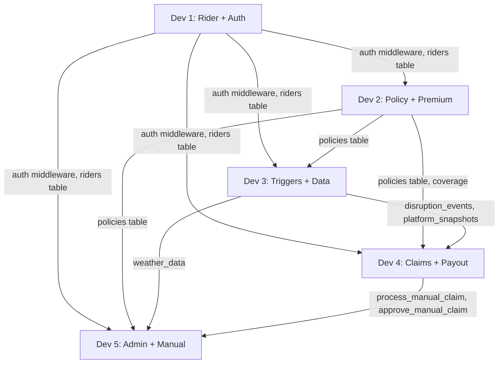

# Zylo — Task Breakdown Walkthrough

## What Was Done

Decomposed the full PRD + TRD into **5 independent task files** under `d:\Guidewire\tasks\`, one per team member.

## Task Files Created

| File | Owner | Primary Modules | Key APIs |
|------|-------|----------------|----------|
| [TASK-1-rider-auth.md](file:///d:/Guidewire/tasks/TASK-1-rider-auth.md) | Dev 1 | Rider Service + Auth + OTP + Redis | `/api/riders/*`, `/health`, `/api/zones` |
| [TASK-2-policy-premium.md](file:///d:/Guidewire/tasks/TASK-2-policy-premium.md) | Dev 2 | Policy Service + ML Premium Engine | `/api/policies/*`, `/api/risk/premium` |
| [TASK-3-triggers-data.md](file:///d:/Guidewire/tasks/TASK-3-triggers-data.md) | Dev 3 | Trigger Service + Data Collectors | `/api/triggers/*`, `/api/disruption-events` |
| [TASK-4-claims-payout.md](file:///d:/Guidewire/tasks/TASK-4-claims-payout.md) | Dev 4 | Claims + Payout + Fraud | `/api/claims/*`, `/api/payouts/*` |
| [TASK-5-admin-manual.md](file:///d:/Guidewire/tasks/TASK-5-admin-manual.md) | Dev 5 | Admin + Manual Claims + Spam | `/api/claims/manual`, `/api/admin/*` |

## Dependency Graph

## Recently Added Trigger Coverage

- Trigger catalog now includes `aqi_grap` for AQI/GRAP stage 3-4 air-quality disruption detection.
- Auto-claims with `fraud_score >= FRAUD_THRESHOLD` are now created as `flagged` and held back from payout for admin review.

## Integration Checkpoints

| Day | Checkpoint | Devs Involved |
|-----|-----------|---------------|
| Day 3 | DB ready, auth middleware available | Dev 1 → All |
| Day 5 | Auth → Policy creation works | Dev 1 + Dev 2 |
| Day 7 | Trigger → Auto-claim → Payout | Dev 3 + Dev 4 |
| Day 9 | Full auto-payout E2E | Dev 1-4 |
| Day 11 | Full E2E including manual claims | All 5 |
| Day 13 | Demo-ready | All 5 |

## Demo Timeline Ownership

| Segment | Owner | Content |
|---------|-------|---------|
| [0:15–0:30] | Dev 1 | Registration + OTP + Zone selection |
| [0:30–1:00] | Dev 2 | Policy tiers + premium difference + purchase |
| [1:00–1:15] | Dev 3 | Trigger injection + auto-detection |
| [1:15–1:30] | Dev 4 | Auto-payout + notification + breakdown |
| [1:30–2:00] | Dev 5 | Manual claim + admin review + approve |
